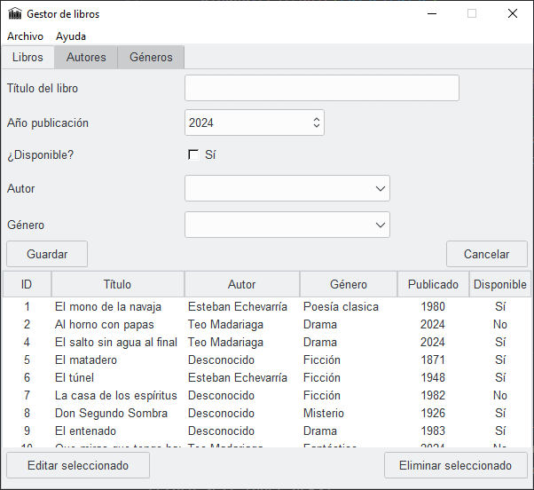
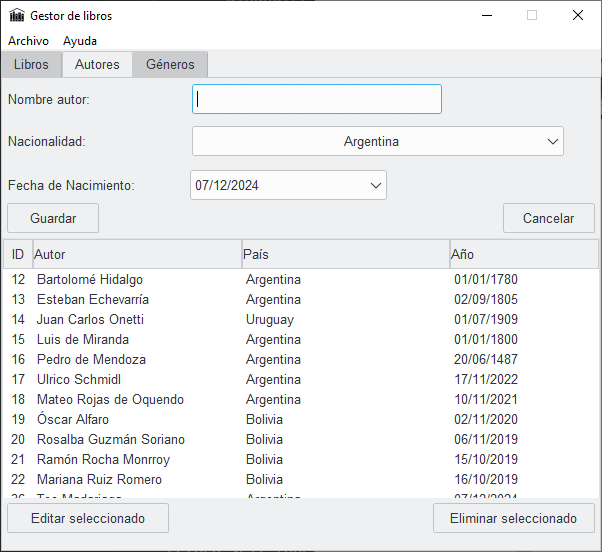
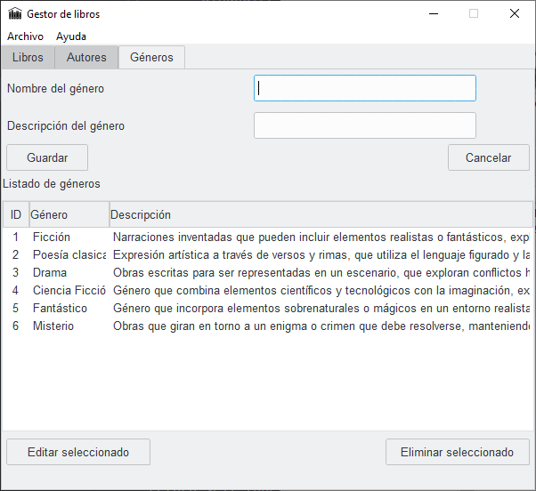

# DESCRIPCION DEL PROYECTO

Esta mini-app consiste en gestionar generos, autores y libros de forma ordenada, para presentar un listado informando si está disponible o no.

## Requerimientos utilizados

> Python 3.12 ó superior

> pip 24.3.1

### Librerias

> tk
> ttkthemes
> tkcalendar

### Material de referencia

> https://www.pythontutorial.net/tkinter/tkinter-grid/

> https://recursospython.com/guias-y-manuales/apariencia-y-estilos-de-los-controles-en-tkinter/

## Setup

#### 
 Opcion On-Promise 

> python3 -m pip install tk ttkthemes tkcalendar

#### 
 Opcion por entorno 

> py -m venv "NombreEntorno"

> Activacion de entorno:
>
> - Linux "source "NombreEntorno"/Scripts/activate"
>
> - Windows "NombreEntorno"/Scripts/activate"

> pip install -r requeriments.txt

## Inicialización

Iniciar con python el archivo main.py

## Screenshots

### Imagenes de muestra

## Autor / Agradecimientos

Teo Madariaga
> linkedin.com/teomadariaga

Agradecimientos al instructor Gabriel por la paciencia y tolerancia en el proceso de aprendizaje.

